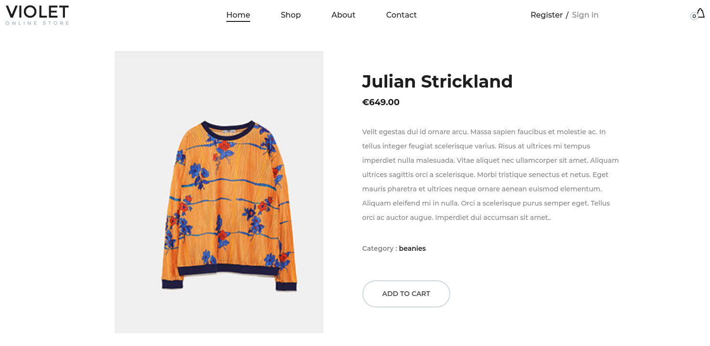
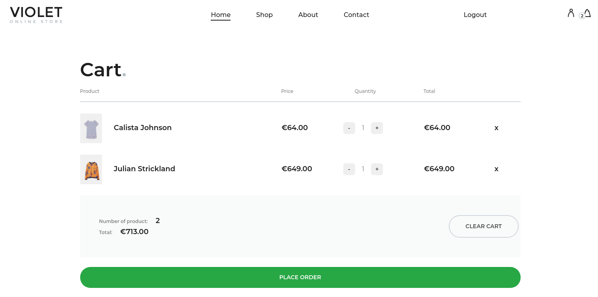
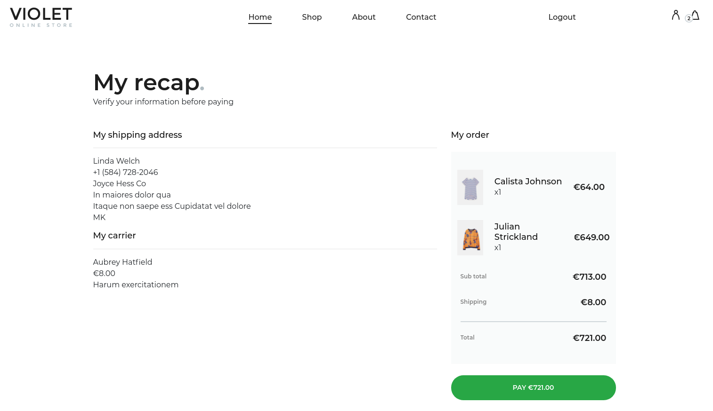
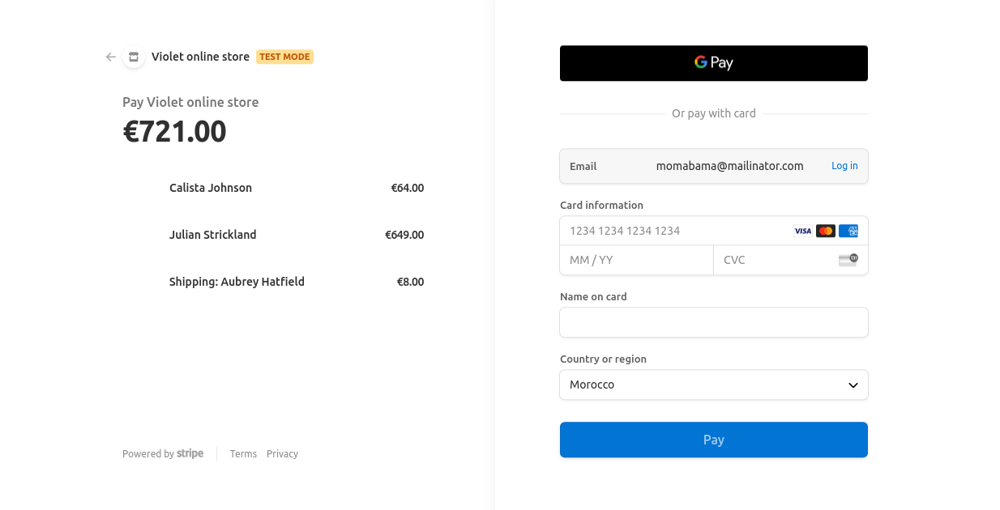
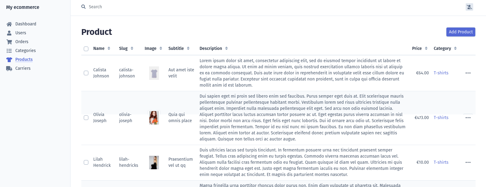

# E-commerce website
I developed this project while learning Symfony framework.

## FRONT-END 
* [x] Show products.
* [x] Product search, filter by categories & name.
* [x] Show product details. 
* [x] Login & Registration.
* [x] Add products to shopping cart. 
* [x] Place Orders. 
* [x] Payment integration(Stripe) 
* [x] Manage Account Addresses & Password.

## Admin
* [x] Order management
* [x] Product management
* [x] Category management
* [x] Carrier management
* [x] User Management

## Screenshots :
 

 

 

 

 

 

 

 
